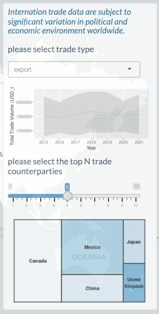
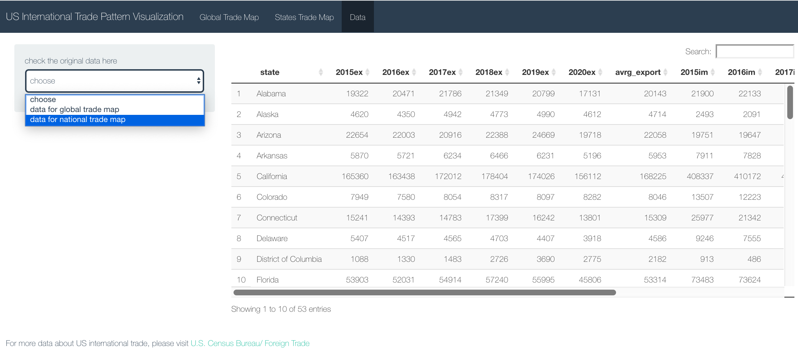

## U.S. International Trade Pattern Interactive Tool

The purpose of this project is to build an interactive App with RShiny based on the international trade data of the U.S. from 2015 to 2021.
This App aims to realize three functions maily:  1)a user‐friendly interactive dashboard 2) a dynamic worldwide map with multiple-year dimensions, and 3) a display platform for intuitive graphs and tables.

International trade data are all obtained from [U.S. Census Bureau/ Foreign Trade](https://www.census.gov/foreign-trade/data/index.html). I use data from the 'product detail and partner country' section(2015-2021) to construct the world trade map and related graphs. Besides, I also use data from 'top 25 trading partner countries for each state' section(2015-2020) to devise the corresponding states' trade map.   

## Shiny interface

Follow [this](https://us-international-trade-pattern-interactive-tool-chunyan-hao.shinyapps.io/ShinyApp/) link for the interactive Shiny app. 

A screenshot of the interface is provided below.

Except for dashboard based on world map, I also provide access to view the original data:

## Analysis code

There are 4 key elements of the analysis code:
- *Data_cleaning.R* – an R script that extracts and creates subtables and variables for the display of Dashboard. Raw data are all saved in the *original_data* folder.Output files are saved in the *main_data* folder.
- *App.R* - an R script used to render the Shiny app. This consists of several plotting functions as well as the ui (user interface) and server code required to render the Shiny app. 
- *Original_data* - a folder containing the original input data relating to the international trade data. 'product detail and partner country' section data are all saved in 'sitc115presdigit.xls'; 'top 25 trading partner countries for each state' section data are saved in 'exctyall_17_20.xls', 'imctyall_17_20.xls', 'exctyall_15_18.xls', 'imctyall_15_18.xls'. I first concat data from 2015 to 2018 and data from 2017 to 2020 together to get 6-year data. Then I generated 'export.csv' and 'import.csv' as pull dataset at state level.
- *Main_data* - a folder containing the  output data generated from data_cleaning section and json files which will be used to construct the world map.

## Other resources

Several resources proved invaluable when building this app, including:
- The [Shiny Gallery](https://shiny.rstudio.com/gallery/) ;
- A [map based shiny App](https://shiny.rstudio.com/gallery/covid19-tracker.html) and an [international trade data display platform](https://shiny.rstudio.com/gallery/nz-trade-dash.html).

## Authors
Chunyan Hao, MS in Data Analytics Engineering, Northeastern University
## Contact
chunyan.hao123@gmail.com
